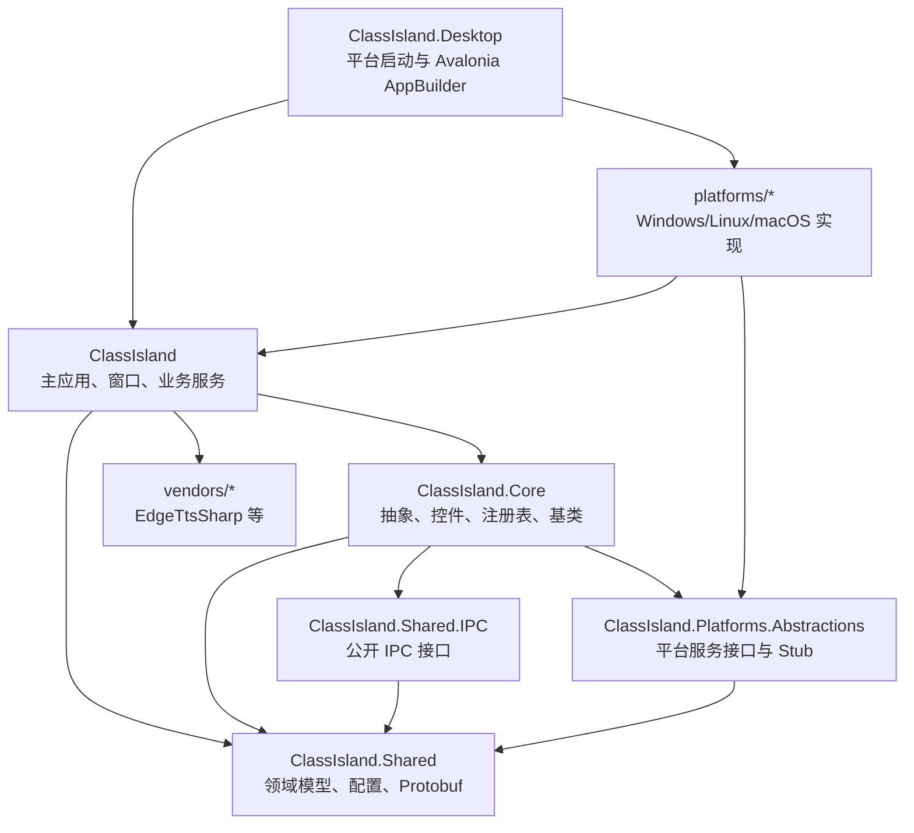

# ClassIsland 架构分析

生成时间：2026-07-09

## 总体结构

## 启动流程

- `ClassIsland.Desktop/Program.cs` 是运行时入口：先根据编译常量激活平台服务，再调用 `ClassIsland.Program.AppEntry(args)` 构造 `App`。
- `ClassIsland/Program.cs` 负责命令行解析、全局存储初始化、单实例 Mutex、Sentry 初始化、进程优先级、MoonSharp 注册。
- `ClassIsland/App.axaml.cs` 在 `DesktopLifetimeOnStartup` 中建立 phony root window、启动 Sentry transaction、设置目录、检查重复实例、恢复模式、更新处理。
- `App.axaml.cs` 随后创建 Generic Host：`Host.CreateDefaultBuilder().ConfigureServices(ConfigureServices).Build()`。
- `ClassIsland/App.Services.xaml.cs` 是应用 DI composition root：注册核心服务、ViewModel、Window、设置页、组件、通知 provider、规则、触发器、Action、授权、语音、主题、教程和插件。
- 主窗口加载后启动 IPC server、自动化服务和规则状态通知，然后把生命周期置为 Running。

## 关键分层

- Desktop 层：只处理平台选择、Avalonia 平台配置、平台服务绑定和资源 overlay loader。
- App 层：承载完整业务功能，是当前最大模块；包括 `Services/`、`Views/`、`ViewModels/`、`Controls/`、`Models/`。
- Core 层：提供可复用 UI 控件、注册表扩展、服务接口和自动化/组件/通知/规则/插件基类。
- Shared 层：承载 profile 领域模型、管理模型、Protobuf、配置读写 helper；需要注意 `net472` 兼容。
- Platform Abstractions 层：用 `PlatformServices` 静态属性暴露窗口、定位、桌面、Toast、文件选择等服务，默认是 Stub。
- Platform Impl 层：按 Windows/Linux/macOS 分项目编译；`ClassIsland.Desktop` 条件引用且一次只应绑定一个平台实现。

## 领域模型

- `Profile` 是课表数据聚合根，包含 Subjects、ClassPlans、TimeLayouts、临时课表、覆盖课表、多周轮换等状态。
- `ClassPlan` 包含课程列表、关联时间表、启用/覆盖/分组等信息。
- `TimeLayout` 和 `TimeLayoutItem` 描述一天内课程/时间点布局。
- `Subject` 描述科目名称、简称、教师、室外课等。
- `LessonsService` 基于 Profile 计算当前/上节/下节课程、时间状态，并触发上课、课间、放学、时间状态变化事件。

## 扩展机制

- 注册表扩展统一落在 `ClassIsland.Core/Extensions/Registry`：`AddComponent`、`AddNotificationProvider`、`AddTrigger`、`AddRule`、`AddAction`、`AddSettingsPage` 等。
- 插件入口继承 `PluginBase`，在 `Initialize(HostBuilderContext, IServiceCollection)` 中注册服务和扩展点。
- `PluginService` 从 `Plugins` 目录与 `-externalPluginPath` 扫描 `manifest.yml`，使用独立 `PluginLoadContext` 加载入口程序集。
- 插件包格式为 `.cipx`，本质为包含 `manifest.yml` 的 zip；SDK target 可在 build 后生成包和 MD5 摘要。

## 数据与配置流

- `CommonDirectories` 管理 AppRoot、Config、Cache、Temp、Logs 等路径；不同打包类型会影响 `AppRootFolderPath`。
- `ConfigureFileHelper` 统一 JSON 读写、备份、损坏恢复和对象深拷贝。
- `SettingsService` 加载 `Settings.json`，并可叠加集控下发设置。
- `ProfileService` 从 `Profiles` 加载当前 profile，并可在集控模式下下载/合并课表、时间表、科目。
- `ComponentsService`、`AutomationService`、`XamlThemeService`、`TutorialService` 各自维护 Config 子目录下的配置文件。

## 外部通信

- IPC：`IpcService` 启动 `dotnetCampus.Ipc` 与 JSON routed provider；`Shared.IPC` 暴露 lessons、profile、URI navigation 等公开服务。
- 集控：`ManagementService` 负责 manifest、policy、credential、versions 和服务端连接；支持 serverless 与管理服务器连接。
- 网络：`WebRequestHelper` 封装 HTTP GET、指数退避、Sentry handler、可选 detached PGP signature 验证。
- 更新：`UpdateService` 处理分发元数据、文件映射、下载、替换、清理和 startup update flow。
